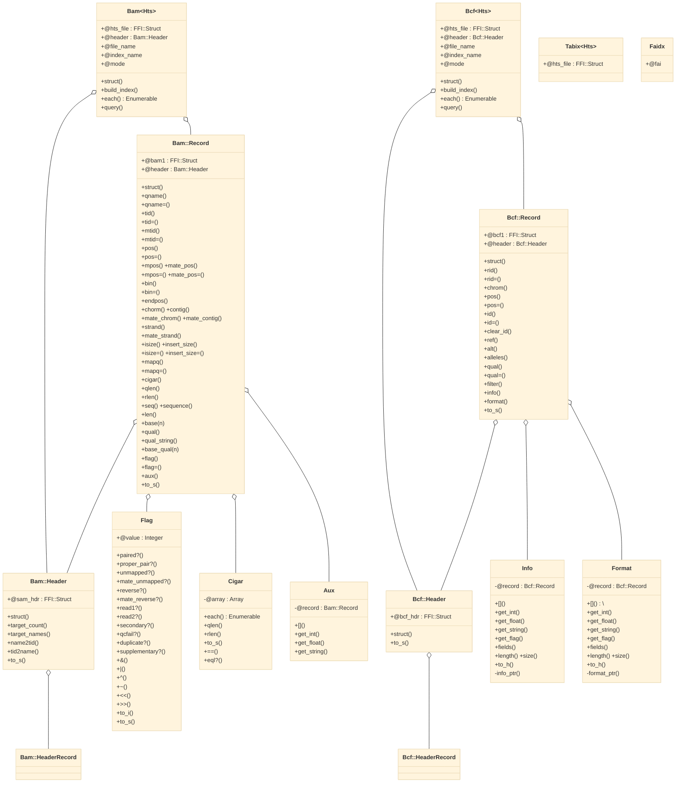

# Tutorial



## Installation

```
gem install htslib
```

You can check which shared libraries are used by ruby-htslib as follows

```ruby
require "htslib"
puts HTS.lib_path
# => "/home/kojix2/.rbenv/versions/3.2.0/lib/ruby/gems/3.2.0/gems/htslib-0.2.6/vendor/libhts.so"
```

## HTS::Bam - SAM / BAM / CRAM - Sequence Alignment Map file

Reading fields

```ruby
require 'htslib'

bam = HTS::Bam.open("test/fixtures/moo.bam")

bam.each do |r|
  pp name: r.qname,
     flag: r.flag,
     chrm: r.chrom,
     strt: r.pos + 1,
     mapq: r.mapq,
     cigr: r.cigar.to_s,
     mchr: r.mate_chrom,
     mpos: r.mpos + 1,
     isiz: r.isize,
     seqs: r.seq,
     qual: r.qual_string,
     MC:   r.aux("MC")
end

bam.close
```

Open with block

```ruby
HTS::Bam.open("test/fixtures/moo.bam") do |bam|
  bam.each do |record|
    # ...
  end
end
```

Writing

```ruby
in = HTS::Bam.open("foo.bam")
out = HTS::Bam.open("bar.bam", "wb")

out.header = in.header
# out.write_header(in.header)

in.each do |r|
  out << r
  # out.write(r)
end

in.close
out.close
```

Create index

```ruby
HTS::Bam.open("foo.bam", build_index: true)
```

```
b = HTS::Bam.open("foo.bam")
            .build_index
            .load_index
```

## HTS::Bcf - VCF / BCF - Variant Call Format file

Reading fields

```ruby
bcf = HTS::Bcf.open("b.bcf")

bcf.each do |r|
  p chrom:  r.chrom,
    pos:    r.pos,
    id:     r.id,
    qual:   r.qual.round(2),
    ref:    r.ref,
    alt:    r.alt,
    filter: r.filter,
    info:   r.info.to_h,
    format: r.format.to_h
end

bcf.close
```

Open with block

```ruby
HTS::Bcf.open("b.bcf") do |bcf|
  bcf.each do |record|
    # ...
  end
end
```

Writing

```ruby
in = HTS::Bcf.open("foo.bcf")
out = HTS::Bcf.open("bar.bcf", "wb")

out.header = in.header
# out.write_header(in.header)
in.each do |r|
  out << r
  # out.write(r)
end

in.close
out.close
```
