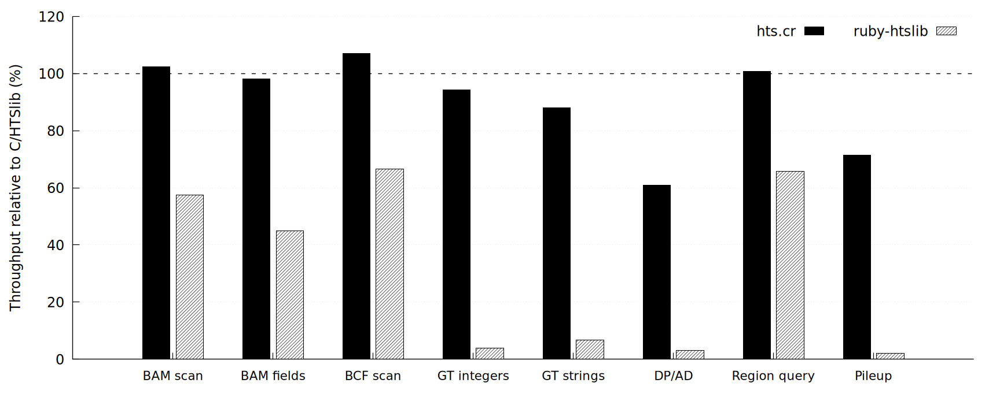

# Summary

`HTSlib` is a C library for reading and writing genomic data and underlies
`samtools` and `bcftools` [@Bonfield2021HTSlib;
@Danecek2021SAMtools]. `hts.cr` and `ruby-htslib` make this functionality
available from Crystal and Ruby. Both libraries support SAM/BAM/CRAM,
VCF/BCF, indexed reference sequences (Faidx), Tabix files,
and pileups.

`ruby-htslib` uses a native Ruby C extension linked directly to the system
HTSlib, whereas `hts.cr` calls HTSlib through Crystal's FFI. These libraries
allow researchers and developers using Ruby or Crystal to process genomic data
within their programs without invoking external command-line tools.

# Statement of need

Dedicated command-line tools are available for many routine genomic data
processing tasks. Research-specific analyses may, however, need to select or
aggregate records from combinations of fields, inspect records interactively,
retain results in custom data structures, or integrate processing with another
library. Such operations may not be expressible through existing command-line
options and can require custom scripts or programs. HTSlib provides parsing,
compression, and indexed access through a C API. Making these facilities usable
from a higher-level language requires more than calling C functions: its files,
headers, records, and their lifetimes must be mapped onto the language's data
model.

Python, Nim, Rust, and C++ have mature HTSlib interfaces, including
`pysam`, `cyvcf2`, `hts-nim`, `rust-htslib`, and `vcfpp`
[@pysam; @Pedersen2017cyvcf2; @Pedersen2018htsnim; @rust_htslib;
@Li2024vcfpp]. These interfaces belong to their respective language ecosystems
and cannot be embedded directly in Ruby or Crystal programs. In Ruby,
`bio-samtools`, a BioRuby plugin, has provided a high-level interface for
SAMtools-based alignment processing, pileups, variant analysis, and
visualisation [@Goto2010BioRuby; @RamirezGonzalez2012BioSamtools;
@Etherington2015BioSamtools2]. In contrast, `ruby-htslib` binds the standalone
HTSlib library and exposes alignment and variant files, headers, and records as
building blocks for Ruby analysis programs. `hts.cr` makes the same HTSlib
facilities available through Crystal's static type system and native
compilation, allowing streaming bioinformatics tools to be written without
implementing their processing core in a second language. The two libraries make
HTSlib operations composable in forms suited to their respective languages.

# Software design

Both libraries represent HTSlib files, headers, and records through a common
record-oriented object model. This model manages native-resource lifetimes and
distinguishes values borrowed only during iteration from values retained
afterward. `Bam`
represents SAM/BAM/CRAM files and `Bcf` represents VCF/BCF files; each retains
its corresponding `Header`. A file object's `each` method yields one `Record`
at a time and reuses the same object and native buffer during iteration. This
avoids materializing the entire file and limits allocation, but a record must be
copied if it is to be retained beyond iteration. Record fields are exposed
through Ruby or Crystal methods for reading and updating, with alignment
auxiliary tags and variant INFO and FORMAT fields represented as typed values.
Region queries and writing use the same file, header, and record objects.

Operations with different units of access are not forced into this common
model. An indexed FASTA file is represented by a `Faidx` object that retrieves
reference subsequences, whereas a Tabix-indexed text file is represented by a
`Tabix` object that returns rows overlapping a region. Rather than representing
another file format, pileup is a position-oriented view derived from `Bam` and
iterates over reference positions together with their overlapping alignments.
Each file object can be opened with a block, which closes the file and releases
its native resources when the block finishes.

Although the libraries share this object model, the ways they expose borrowed
values and retain results reflect the use of each language. The `ruby-htslib` C
extension stores HTSlib pointers in typed Ruby objects and registers the
corresponding cleanup functions with the garbage collector.
Iteration reuses a native record buffer, whereas records and fields retained
beyond iteration are copied into independent Ruby objects. BCF FORMAT fields
can also be accessed through borrowed views of reusable buffers without
copying. Users can therefore choose between retaining values as Ruby arrays and
strings and processing borrowed values during iteration to limit allocation.

`hts.cr` wraps HTSlib pointers in statically typed Crystal objects and
expresses the distinction between borrowed and owning data through types and
block scope. Native buffers can be exposed as block-scoped `Slice` values or
borrowed views, and primitive iterators process fields without creating
intermediate arrays or strings. Copying only the values needed beyond iteration
reduces heap allocation and garbage collection pressure. Together with
Crystal's native compilation, this structure supports efficient record-by-record
processing of HTSlib data in streaming tools.

# Performance evaluation

To characterize the runtime overhead of the two libraries, we implemented the
same workloads in C, `hts.cr`, and `ruby-htslib` and compared their throughput.
All three implementations used HTSlib 1.22.1-51-gcd2a6f61 and ran
single-threaded on Ubuntu 26.04 LTS. The C baseline was compiled with gcc
15.2.0 (`-O2`), `hts.cr`
0.4.0 with Crystal 1.21.0
(LLVM 20.1.8, `--release`), and `ruby-htslib` 0.6.0 with Ruby 4.0.6. The
comparison therefore reflects the costs of crossing the language boundary and
of the data representations exposed by each API, rather than differences in
HTSlib itself.

The synthetic inputs comprised a BAM file containing 300,000 100 bp single-end
reads over a 2 Mbp reference (approximately 15x mean depth) and a BCF file
containing 50,000 sites and 20 samples with GT, DP, AD, and GL FORMAT fields.
The BAM file was coordinate-sorted, and both files were indexed. Region-query
and pileup workloads used a 100 kb interval (`chr1:500,000-600,000`) overlapping
14,902 reads. Pileup base counting applied a minimum base quality of 13 and no
mapping-quality filter. Each workload was run five times, and the table reports
median throughput. After the first run, the inputs fit in the page cache. The
scripts are included in the `benchmark` directory.

{width=100%}

| Workload | C/HTSlib | `hts.cr` | `ruby-htslib` |
| --- | ---: | ---: | ---: |
| Sequential BAM record scan | 2,938,000 records/s | 3,009,000 records/s | 1,689,000 records/s |
| BAM scan with flag and coordinate access | 2,949,000 records/s | 2,895,000 records/s | 1,326,000 records/s |
| Sequential BCF record scan | 1,624,000 records/s | 1,738,000 records/s | 1,080,000 records/s |
| FORMAT/GT integer traversal | 1,425,000 records/s | 1,345,000 records/s | 54,000 records/s |
| FORMAT/GT string conversion | 438,000 records/s | 386,000 records/s | 29,000 records/s |
| FORMAT/DP and FORMAT/AD traversal | 1,357,000 records/s | 827,000 records/s | 43,000 records/s |
| Region query (first / mean of 20 repeats) | 2,622,000 / 2,674,000 records/s | 2,634,000 / 2,694,000 records/s | 1,725,000 / 1,761,000 records/s |
| Pileup base counting | 6,792,000 columns/s | 4,846,000 columns/s | 140,000 columns/s |

For sequential record scans, integer FORMAT access, and region queries,
`hts.cr` achieved 94--107% of the C throughput. Throughput was 88% of C when
converting each sample's genotype to a string, 61% for FORMAT/DP and FORMAT/AD
traversal, and 71% for pileup base counting. Thus, `hts.cr` approached C
throughput when it could process native buffers directly, while string
creation and traversal through higher-level views incurred additional costs.

`ruby-htslib` achieved 45--67% of the C throughput for sequential scans and
region queries. The gap was larger for FORMAT and pileup processing, where its
throughput was 2--7% of C. The integer GT and DP/AD workloads used an iterator
or borrowed view to limit allocations, but conversion to Ruby values and block
dispatch still occurred for individual values. GT string conversion and pileup
used `genotype_strings` and `each_base_counts`, which return owning values and
therefore include the costs of copying and object creation. All three
implementations processed the same record counts and counted the same total of
1,017,916 pileup bases.

This evaluation is intended to characterize representative execution paths in
the APIs presented here, rather than to establish a general ranking of the
languages. The measurements come from one machine and one synthetic dataset and
do not predict end-to-end performance on production data or larger files.

# Research impact statement

Within BioCrystal, `hts.cr` is used by `bam-filter`, a command-line tool for
filtering BAM/CRAM files with expressions, and by `bamboo`, a BAM viewer built
with libui-ng [@bam_filter; @bamboo].

# AI usage disclosure

Codex was used in preparing this manuscript.

# Acknowledgements

Development of `ruby-htslib` received partial support from the Ruby Association
Grant 2020 [@ruby_association_grant]. The author thanks the developers of
HTSlib, SAMtools, BCFtools, Ruby, and Crystal, and the associated bioinformatics
communities. The funder had no role in the software design or decision to
submit. The author declares no competing interests.

# References
